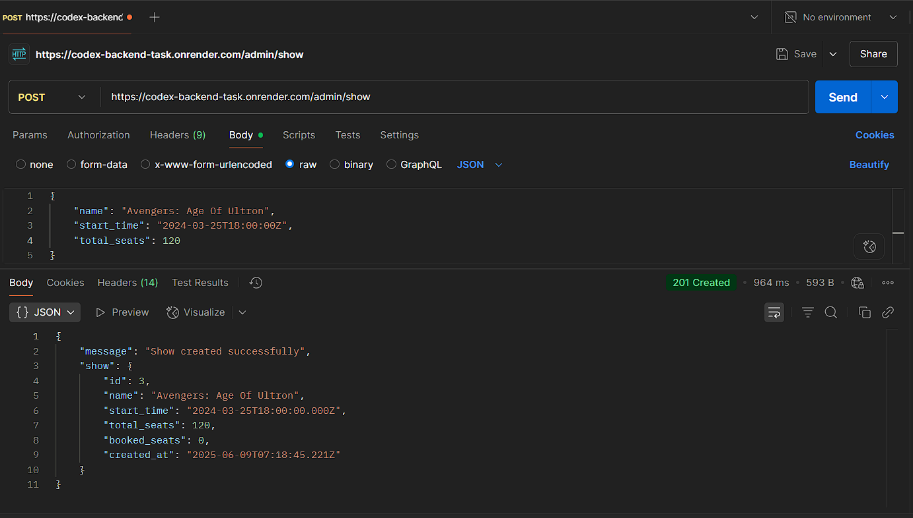
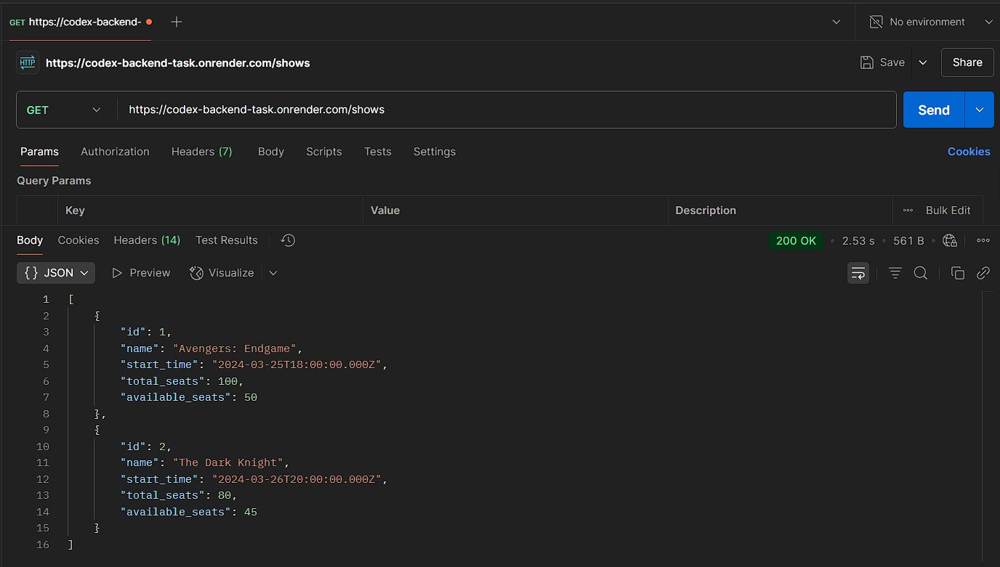
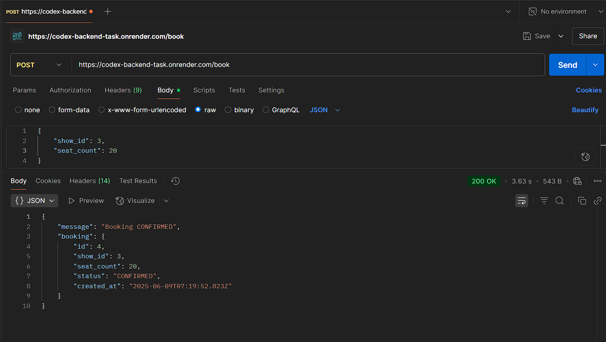
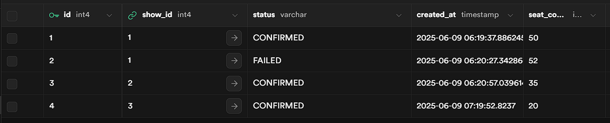
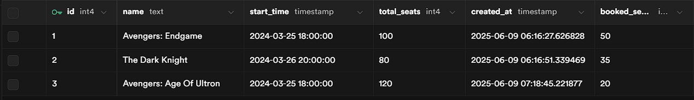

# Ticket Booking System

A scalable ticket booking system built with Node.js, Express.js, and PostgreSQL (Supabase) for handling concurrent bookings efficiently.

## Live Demo

API is deployed at: [https://codex-backend-task.onrender.com](https://codex-backend-task.onrender.com)

## Features

- Show management (create shows with seats)
- Real-time seat availability checking
- Concurrent booking handling with transaction support
- Automatic booking expiry for pending bookings
- Race condition prevention using database transactions

## Prerequisites

- Node.js (v14 or higher)
- Bun package manager
- Supabase account and database

## Setup

1. Clone the repository:

```bash
git clone <repository-url>
cd <repository-name>
```

2. Install dependencies:

```bash
bun install
```

3. Create a `.env` file in the root directory with the following variables:

```
SUPABASE_URL=your_supabase_connection_string
PORT=3000
```

4. Run the database migrations:

```bash
psql -U your_username -d your_database -f schema.sql
```

5. Start the server:

```bash
bun run index.js
```

## API Documentation

### Admin Routes

#### Create a Show

- **POST** `/admin/show`
- **Body:**
  ```json
  {
    "name": "Movie Name",
    "start_time": "2024-03-20T18:00:00Z",
    "total_seats": 40
  }
  ```
- **Response:**
  ```json
  {
    "message": "Show created successfully",
    "show": {
      "id": 1,
      "name": "Movie Name",
      "start_time": "2024-03-20T18:00:00Z",
      "total_seats": 40,
      "booked_seats": 0
    }
  }
  ```
  

### User Routes

#### Get All Shows

- **GET** `/shows`
- **Response:**
  ```json
  [
    {
      "id": 1,
      "name": "Movie Name",
      "start_time": "2024-03-20T18:00:00Z",
      "total_seats": 40,
      "available_seats": 35
    }
  ]
  ```
  

#### Book Seats

- **POST** `/book`
- **Body:**
  ```json
  {
    "show_id": 1,
    "seat_count": 2
  }
  ```
- **Response:**
  ```json
  {
    "message": "Booking CONFIRMED",
    "booking": {
      "id": 1,
      "show_id": 1,
      "seat_count": 2,
      "status": "CONFIRMED",
      "created_at": "2024-03-19T10:00:00Z"
    }
  }
  ```
  

## Technical Implementation

### Concurrency Handling

The system uses PostgreSQL transactions with row-level locking to prevent race conditions and overbooking. When a booking request is made:

1. The show row is locked using `FOR UPDATE`
2. Available seats are checked
3. If seats are available, the booking is confirmed
4. If seats are not available, the booking is marked as failed
5. All operations are wrapped in a transaction

### Booking Expiry

Pending bookings automatically expire after 2 minutes. A background job runs every minute to:

1. Find pending bookings older than 2 minutes
2. Mark them as failed
3. Release the seats back to the available pool

### Error Handling

The API returns appropriate HTTP status codes:

- 200: Success
- 400: Bad Request (invalid input)
- 404: Not Found
- 500: Internal Server Error

## Database Snapshots

### Bookings Table



### Shows Table



## Technical Design

For detailed technical design and architecture, please refer to [TECHNICAL_DESIGN.md](./TECHNICAL_DESIGN.md)
